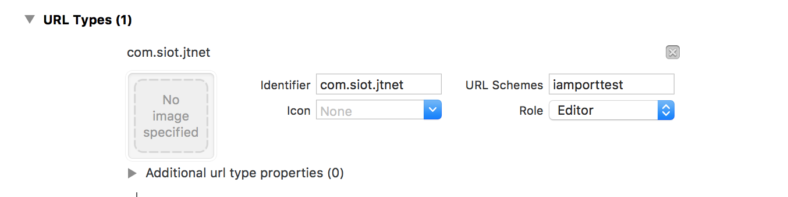

# [DEPRECATED]

안녕하세요! 아임포트 서비스를 이용해 주셔서 감사합니다!

이 프로젝트는 그동안 잘 사용됐으나, 지금은 ⛔ **Deprecated** ⛔  되었습니다.

앞으로는 🌱 [아임포트에서 제공하는 최신 SDK][123] 🌱 를 사용하셔서 

더 편리하고, 안정적인 결제 개발에 도움 받으시길 바랍니다!

[123]: https://github.com/iamport/iamport-ios


# iamport-jtnet-ios
JTNet iOS 앱 내 결제 지원을 위한 샘플 프로젝트

아임포트 내에서 app_scheme 관련 JTNet을 위한 파라메터는 자동 처리되고 있습니다. 
다음과 같은 2가지 설정이 필요합니다. 

## 1. Xcode에서 URL Scheme 설정  
다음과 같이 개발하시는 앱 설정(Target > Info)에서 앱이 사용할 URL Scheme을 정의합니다.  
URL Scheme은 ISP/앱카드 등 인증을 위해 외부 앱으로 빠져나간 경우, 인증 후 원래 앱 결제프로세스로 돌아오기 위해 사용됩니다.  
*(인증이 끝난 후 URL Scheme이 호출됨으로써 나의 앱으로 돌아옵니다.)*



예시에서는 iamporttest로 설정하였습니다.  

## 2. IMP.request_pay() 호출시 app\_scheme 추가
다음 코드와 같이 결제를 위해 호출하는 IMP.request\_pay() 파라메터에 Xcode에서 정의한 것과 동일한 값을 app\_scheme 속성으로 추가합니다.  

```javascript
IMP.request_pay({
	...
	app_scheme : 'iamporttest'
	...
});
```
